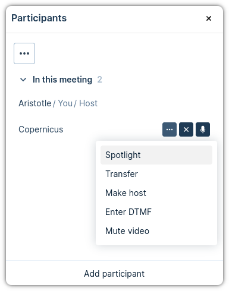
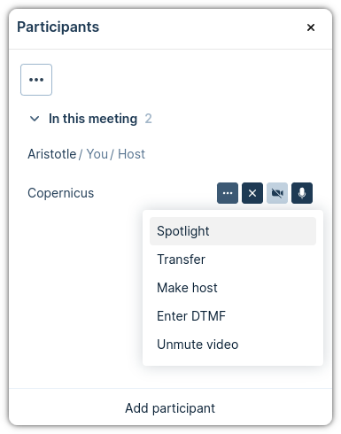

# Web App 3 Plugin: Video mute

This plugin adds the possibility to host users to mute and unmute participants.

Take into account that we have two levels of mute for protecting the user
privacy:

- **Client mute:** Each participant can mute/unmute himself.
- **Server mute:** The host can choose to mute/unmute a participant.

The video muted parameter will take different value depending on the client and
server mutes:

| Client mute | Server mute | Muted value |
| ----------- | ----------- | ----------- |
| Muted       | Muted       | Muted       |
| Muted       | Unmuted     | Muted       |
| Unmuted     | Muted       | Muted       |
| Unmuted     | Unmuted     | Unmuted     |

## How to use

The button is created in the available actions for each participant in the
participant list.

If you click on the three dots on the side of a participant, you will see the
action "Mute video" that the host can use to mute a specific participant:

<div align='center'>



</div>

In case the participant is already video muted, the action will change to
"Unmute video":

<div align='center'>



</div>

## Run for development

- To be able to build the plugin, you need to comply with the following versions
  or higher:

  | NodeJS   | NPM     |
  | -------- | ------- |
  | v20.12.2 | v10.5.0 |

- Install all the dependencies:

```bash
$ npm i
```

- Run the dev environment:

```bash
$ npm start
```

The plugin will be served from https://localhost:5173 (visit that page and
accept the self-signed certificates), but you should access it thought the Web
App 3 URL. You have more information about how to configure your environment in
the
[Developer Portal: Setup guide for plugin developers](https://developer.pexip.com/docs/plugins/webapp-3/setup-guide-for-plugin-developers).

## Build for production

To create a package, you will need to first install all the dependencies:

```bash
$ npm i
```

And now to create the package itself:

```bash
$ npm run build
```

Congrats! Your package is ready and it will be available in the `dist` folder.
The next step is to create a Web App3 branding and copy `dist` into that
branding.

If you want to know more about how to deploy your plugin in Pexip Infinity,
check our [Developer Portal](https://developer.pexip.com).
